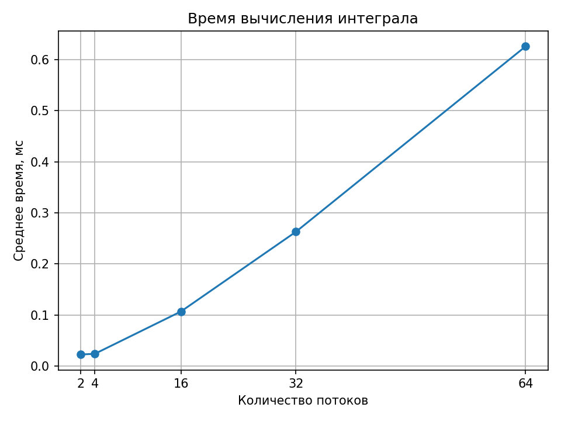

# Численное интегрирование с помощью OpenMP

## Цель работы

Написать программу на C++, которая вычисляет интеграл методом Симпсона, и проверить, как количество потоков влияет на время работы.

Дана функция f(x) = √(x(3−x))/(x+1), отрезок [1; 1,2] и точность 10⁻⁶.

## Ход работы

Сначала программа делит отрезок на две равные части и считает интеграл по формуле Симпсона. Затем число частей увеличивается в два раза и расчёт повторяется.

Точность проверяется по правилу Рунге: разницу между новым и предыдущим результатом берём по модулю и делим на 15. Если полученное число не больше 10⁻⁶, программа заканчивает расчёт.

Для параллельного вычисления используется OpenMP. Потоки считают значения функции в разных точках, после чего их результаты складываются. В OpenMP работа распределяется между потоками, поэтому в эксперименте менялось именно число потоков.

## Результаты

Полученное значение интеграла — **0,137627888327**. Для заданной точности хватило **4 частей**. Оценка ошибки по Рунге составила примерно **1,08·10⁻⁸**.

Время измерялось для 2, 4, 16, 32 и 64 потоков. Каждый расчёт повторялся 20 раз, затем вычислялось среднее время. График построен на Python по результатам программы.

Замеры выполнены на Intel Core i3-1005G1 с четырьмя логическими процессорами, в Linux. Программа собрана с GCC 13.3.0 и флагами `-O2 -fopenmp`, запускалась с `OMP_WAIT_POLICY=PASSIVE`.

| Количество потоков | Среднее время, мс |
|---:|---:|
| 2 | 0,022418 |
| 4 | 0,023725 |
| 16 | 0,106725 |
| 32 | 0,262776 |
| 64 | 0,626204 |

## Вывод

Программа вычислила интеграл с заданной точностью. В этом опыте увеличение числа потоков не дало ускорения: время работы выросло. Это связано с тем, что сам расчёт очень маленький, а на запуск потоков и ожидание их завершения тоже тратится время. Кроме того, на компьютере доступны только четыре логических процессора. Поэтому для этой задачи большое количество потоков оказалось невыгодным.
